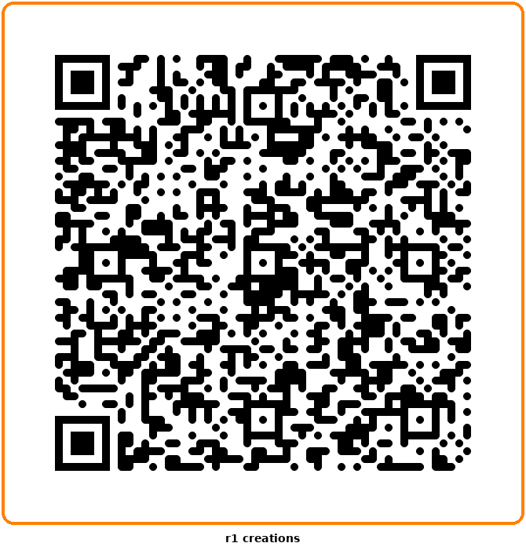

# Soccerway R1

**v3.0.0** — Native live soccer scores for the Rabbit R1 (240x282), styled like soccerway.com with full match details.

**Live URL:** https://player585.github.io/Soccerway-R1/

## Install on R1

1. Scroll to **Creations** card
2. Tap **Create** → **Add via QR code**
3. Scan the QR code above

## What it shows

Native Soccerway-style scoreboard for 22 leagues with full match details:

**International:** World Cup, Club World Cup, FIFA Confederations Cup, Women's WC, Copa America, Gold Cup, UEFA Nations League, Euros

**Continental:** UEFA Champions League, Europa League

**Domestic:** Premier League, La Liga, Serie A, Bundesliga, Ligue 1, MLS, NWSL, Liga MX, Brasileirão, Argentine Primera, FA Cup, Carabao Cup

## Top Tabs

- **LIVE** — only in-progress matches (live minute counter pulses)
- **TODAY** — every match across all leagues (live, scheduled, finished)
- **COMPS** — grid of all competitions (live count badge per comp)

## Match Detail (4 sub-tabs)

Open any match to see:

- **SUMMARY** — Big scoreboard + key events timeline (goals ⚽, yellow cards, red cards, substitutions ⇄, VAR decisions, with minute + HOME/AWAY side)
- **STATS** — Head-to-head bars for Fouls, Yellow Cards, Red Cards, Offsides, Corner Kicks, Saves
- **LINEUP** — Starting XI per team with jersey numbers, positions, and formation; substitutes section
- **INFO** — Competition, kickoff time, venue, attendance, referee, full team names, status, and top-6 standings when available

## Competition Detail (2 sub-tabs)

Open any competition to see:

- **MATCHES** — Today's matches in that competition
- **TABLE** — Full league standings (Rank, Team, GP, GD, PTS)

## R1 Controls

| Input | List View | Match Detail | Comp Detail |
|-------|-----------|--------------|-------------|
| **Scroll Wheel** | Navigate matches | Scroll detail | Scroll matches/standings |
| **PTT Click** | Open match | Cycle sub-tabs (SUMMARY → STATS → LINEUP → INFO) | Open match / cycle MATCHES↔TABLE |
| **Long Press** | Refresh now | Go back | Go back |
| **Touch** | Tap any card or tab | Same | Same |

Arrow Left/Right cycles sub-tabs inside detail views, or top tabs at root.

## Features

- **Auto-refresh** every 30 seconds with countdown timer in footer
- **Soccerway visual identity** — Navy `#001e28` background, orange `#ff8000` accent
- **Live indicator** — Pulsing dot + count in header
- **Winner highlighting** — Bold text + colored score for the winning team
- **Compact match cards** — Soccerway-style: time | flag + name (×2) | scores stacked
- **Detail views** — Comprehensive data per match (events, stats, lineups, info, standings)

## Tech

- Single `index.html`, zero dependencies, zero build step
- Data from ESPN's free public Soccer API (no auth, CORS open)
- Cache-busting meta tags prevent stale R1 storage
- Hosted free on GitHub Pages

## Keyboard (Browser Testing)

| Key | Action |
|-----|--------|
| ↑ / ↓ | Scroll wheel / navigate |
| ← / → | Switch tabs (sub-tabs inside detail) |
| Enter | PTT click |
| Escape | Back / refresh |
